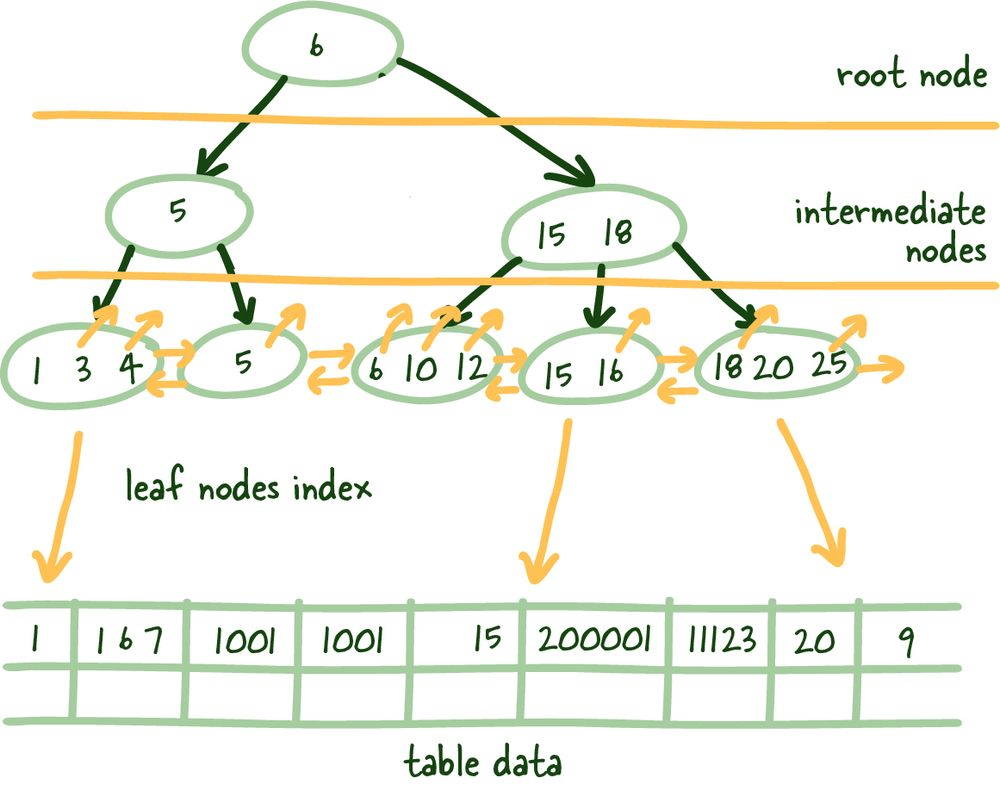

<!-- markdownlint-disable MD010 -->
# 关于数据库你需要知道的事情

> 原文链接：<https://architecturenotes.co/things-you-should-know-about-databases/>
>
> 翻译：[Akagi201](https://github.com/Akagi201)


这是《你应该知道的事情》系列的第一篇文章。把它看作是一个引子，让你从各种主题的基本原则出发。例如，今天我们讨论的是数据库！

考虑到数据库在我们的应用程序中存储了几乎所有的状态，人们对数据库在表面上的运作方式知之甚少，这常常令人惊讶。然而，这对于大多数系统的整体成功来说是基础性的。因此，今天，我将解释在使用 RDBMS 时最重要的两个主题：索引和事务。

因此，在没有完全进入数据库特定怪癖的情况下，我将涵盖你应该了解的关于 RDBMS 索引的一切。我将简要地谈一谈事务和隔离级别，以及它们如何影响你对特定事务的推理。


> ## 什么是 RDBMS?
>
> 关系数据库是一种基于关系数据模型的数字数据库，由 E.F. Codd 在 1970 年提出。关系数据库管理系统（RDBMS）被用来维护关系数据库。许多关系数据库系统有一个选项，即使用 SQL（结构化查询语言）来查询和维护数据库。例子包括 MySQL 和 PostgreSQL。

## 什么是索引？

索引是一种数据结构，有助于减少请求数据的查找时间。索引在实现这一目标时，需要付出存储、内存和保持更新（较慢的写入速度）的额外成本，这使得我们可以跳过检查每个表行的繁琐任务。

就像教科书后面的索引一样，它可以帮助你找到正确的一页。我不太喜欢书中的比喻，随着我们对数据库索引的深入挖掘，它很快就散架了，但这是介绍这个主题的一个很好的方法。

### 为什么我们需要索引？

小量的数据是可以管理的，但是，（想想一个小班级的出勤表）当它们变大时（想想一个大城市的出生登记）就不那么容易了。过去快速的一切都变得缓慢，太慢了。

想一想，如果你不得不在一页纸上找东西，而不是在一千页纸上找东西，你的策略会有什么变化。不，说真的，花点时间想一想。

一些数据库在某些时候已经实施了几乎所有你能想到的好策略。随着他们的成长，系统收集和存储了更多的数据，最终导致了上面的问题。

我们需要索引来帮助我们尽可能快地获得我们需要的相关数据。

### 索引如何工作？


> 读取性能随着你对数据的索引而增加，但这是以写入性能为代价的，因为你需要保持索引的更新。

因此，上面经常提出的一个解决方案是，按照你如何搜索它的逻辑来存储这些数据。意思是说，如果你想按名字搜索列表，你就按名字对列表进行排序。这种策略有几个问题。在这里，我将主要以问题的形式向读者提出。

1. 如果你想以多种方式搜索数据怎么办？
2. 你将如何处理向列表中添加新数据的问题？这样做快吗？
3. 你如何处理更新？
4. 在这些任务上，算法复杂度 O 表示是什么？

一些需要思考的问题。不管你的原始策略是什么，我们肯定需要一种方法来维持秩序，这样我们就可以快速获得相关的无序数据（关于这一点，很快就会有更多的内容）。

> 我们希望建立互联网上最大的系统设计社区！我们很希望你能加入我们。你可以在 [Twitter](https://twitter.com/arcnotes) 上找到我们。你也可以在 [这里](https://twitter.com/myusuf3) 联系作者，以获得反馈。

让我们查看下面的图例 1.1

+─────+─────────+──────────────+
| id  | name    | city         |
+─────+─────────+──────────────+
| 1   | Mahdi   | Ottawa       |
| 2   | Elon    | Mars         |
| 3   | Jeff    | Orbit        |
| 4   | Klay    | Oakland      |
| 5   | Lebron  | Los Angeles  |
+─────+─────────+──────────────+

> 图例 1.1 容易从磁盘快速读取的小表

底层数据被无序地分散在存储设备中，并被随机地分配。现在，大多数生产型服务器都配备了固态硬盘，但在某些情况下，你会需要（HDD）来切换磁盘，但说实话，随着固态硬盘价格的大幅下降，这种理由越来越少了。

> ### SSD vs. HDD
>
> 固态硬盘（SSD）和硬盘（HDD）的主要区别在于数据的存储和访问方式。HDD 使用机械旋转的磁盘和移动的读/写头来访问数据（延迟），而 SSD 使用更快的内存芯片，特别是在读取许多小文件时。因此，如果价格不是问题，SSD 是一个更好的选择--尤其是现代 SSD 和 HDD 一样可靠。

现在，将少量的数据读入内存是相当快的，而且扫描起来也相对微不足道。现在，如果我们要搜索的数据不能完全缓存在内存中呢？或者从磁盘上读取所有数据的时间太长？

+──────────+─────────+───────────────────+
| id       | name    | city              |
+──────────+─────────+───────────────────+
| 1        | Mahdi   | Ottawa            |
| 2        | Elon    | Mars              |
| 3        | Jeff    | Orbit             |
| 4        | Klay    | Oakland           |
| 5        | Lebron  | Los Angeles       |
| ...      | ...     | ...               |
| 1000000  | Steph   | San Francisco     |
| 1001000  | Linus   | Portland          |
+───────+─────────+──────────────────────+

> 图例 1.2 大表不能完全放在内存中，而是分散在磁盘上

因此，这里是大多数开发人员去的地方--我以前见过这个问题；我们需要一些字典（哈希图）和一种方法，以获得我们正在寻找的特定行，而不必扫描缓慢的磁盘，读取大量的块，看看我们需要的数据是否在那里。

这些被称为索引的叶子节点被赋予一个特定的列作为索引，它们可以存储匹配行的位置。


这些索引叶子节点是索引列和相应行在磁盘上的位置之间的映射。这为我们提供了一种快速的方法，如果你通过索引列来引用某条特定的行，就可以找到它。扫描索引的速度会快很多，因为它是你要搜索的列的紧凑表示（更少的字节）。它为你节省了读取一堆块来寻找所需数据的时间，而且更便于缓存，进一步加快了整个过程的速度。

> 数据的规模往往对你不利，而平衡树是你对抗它的第一个工具。

这些索引的叶子节点是统一大小的，我们试图在每个块中尽可能多地存储这些叶子节点。由于这种结构需要对事物进行排序（逻辑上，而不是磁盘上的物理排序），我们需要解决必须快速添加和删除数据的问题；好的老式链接列表可以管理这个问题，更确切地说，是一个双链接列表。

> ## 块
>
> 在计算中，块是一组字节，通常包含固定数量的记录，这些记录受限于总长度（块长度）。因此，如果我们要计算存储一行所需的字节数除以块的长度，就可以得出从一个特定的块中可以读取多少行。在一个非常低的水平上，你可以用它来推理你的系统可以有多高的性能。当你进行容量规划时，Quick Maths™可以非常强大。

这里的好处是双重的：它允许我们向前和向后读取索引叶子节点，当我们删除或添加新的行时，可以快速重建索引结构，因为我们只是修改了指针--强大的东西。

> ## 链接列表
>
> 链接列表是一个数据元素的线性集合，其顺序不是由它们在内存中的物理位置决定的。相反，每一块都指向下一块。它是一种数据结构，由代表一个序列的节点集合组成。在其最基本的形式中，每个节点都包含数据和对该系列中下一个节点的引用（换句话说，一个链接）。

由于这些叶子节点在磁盘上并不是按顺序排列的（记得指针在双链表中保持排序），我们需要一种方法来获得正确的索引叶子节点。

### 平衡树 (B-Tree)


> 数据结构对比：Btree vs B+Tree

所以你可能会想，你在哪里犯了一个巨大的错误，发现自己在学校里读到了你讨厌的 B-Tree。我明白这些东西很无聊，但它们很强大，值得理解。

B+Trees 允许我们建立一个树形结构，每个中间节点都指向其各自叶子节点的最高节点值。它为我们提供了一条清晰的路径，以找到将指向必要数据的索引叶子结点。

这种结构是自下而上建立的，因此一个中间节点覆盖所有叶子节点，直到我们到达顶部的根节点。这种树状结构之所以被称为平衡，是因为整个树的深度是统一的。

> ## B-Tree vs. B+Tree
>
> B+树炫耀的主要区别是，中间节点不在上面存储任何数据。相反，所有的数据引用都链接到叶子节点上，这样可以更好地缓存树结构。
> 其次，叶子节点是链接的，所以如果你需要做索引扫描，你可以做一个单一的线性传递，而不是上下遍历整个树，从磁盘上加载更多的索引数据。



> B+Tree 如何在 RDBMS 中使用

### 对数可扩展性

我想在这里简单说一下，把这个结构的威力打出来。当然，大多数开发人员都知道数据的指数增长，最好是你公司的估值。但不幸的是，数据的规模往往对你不利，而平衡树是你对抗它的第一个工具。

根据中间节点可以引用的项目数量（M）加上整个树的深度（N），我们可以引用 M 到 N 个对象。

下面是一个表格，说明了 M 值为 5 的概念。

| Tree Height (N) 	| Index Leaf Nodes 	|
|-----------------	|------------------	|
| 3               	| 125              	|
| 4               	| 625              	|
| 5               	| 3125             	|
| 6               	| 15625            	|
| 7               	| 78125            	|
| 8               	| 390625           	|
| 9               	| 1953125          	|

因此，当索引叶子节点的数量呈指数增长时，相对于索引叶子节点的数量，树的高度增长得非常慢（对数）。这一点加上平衡的树高，几乎可以立即识别出指向磁盘上实际数据的相关索引叶子节点。

这不是一个美丽的景象吗？

## 什么是事务？

事务是你想作为一个工作单位来处理的。因此，它要么完全发生，要么根本不发生。我认为大多数系统不需要手动管理事务，但在有些情况下，增加的灵活性对达到预期效果很有帮助。事务主要是处理 ACID 中的 I，即隔离。

> ### 什么是 ACID?
>
> 在计算机科学中，ACID（原子性、一致性、隔离性、耐久性）是数据库事务的一组属性，旨在保证数据的有效性，尽管有错误、断电和其他意外。
>
> * 原子性的保证可以防止数据库的更新只部分成功，这比直接拒绝整个系列的更新会造成更多的问题。
> * 一致性保证事务可以将数据库从一个有效的状态转移到下一个状态。这确保这些都遵守所有定义的数据库规则。同时也防止非法事务的损坏。
> * 隔离性决定了一个特定的动作如何显示给其他并发的系统用户。
> * 持久性是保证已经提交的事务将永久存活的属性。
>
> 这些概念一般都很好理解，但根据数据库系统的不同，它们的定义在不同的系统中可能并不一致。所以一定要为你的生产数据库读懂每一个概念。

这些可以自动为你完成，所以你甚至不知道它们正在发生，或者你可以像这样手动创建它们。

```SQL
-- Manual transaction with commit. 
BEGIN;
SELECT * FROM people WHERE id =1;
COMMIT or ROLLBACK;
```

> 图例 1.3: 如何手动创建一个事务

我们将重点关注 BEGIN 和 COMMIT 或 ROLLBACK 之间的时间，以及其他各种事务在相同数据上发生的情况。

> ### COMMIT/ROLLBACK
>
> 所有的手动事务要么以成功的 COMMIT 结束，要么以 ROLLBACK 结束。
>
> * COMMIT 持久性地保留了当前事务所做的改变。
> * ROLLBACK 撤消了当前事务所做的改变。
>
> 当你没有手动管理事务时，如果一个事务中的所有查询都成功完成，它们就被 COMMITTED。如果有任何失败，该事务中的变化就会被 ROLLBACK，以确保整个动作的原子性。

### 读取现象

在这些隔离中可能会出现一些读取现象，了解这些现象对于调试你的系统和诚实地帮助了解你的系统能够容忍什么样的不一致是至关重要的。

#### 不可重复读


如上图所示，如果你在事务中的两次后续读取之间不能获得一致的数据视图，就会发生不可重复的读取。在特定的模式下，并发的数据库修改是可能的，可能会有这样的情况：你刚读的值被修改，导致不可重复的读取。

#### 脏读


同样地，当你执行了一次读取，另一个事务更新了同一行，但没有提交工作，你执行了另一次读取，你可以访问未提交的（脏）值，这不是一个持久的状态变化，与数据库的状态不一致，就会发生脏读取。

#### 幻读


幻读是另一种提交读取现象，它发生在你最常处理总量的时候。例如，你在一个特定的事务中要求获得客户的数量。在随后的两次读取之间，另一个客户注册或删除了他们的账户（已提交），如果你的数据库不支持这些事务的范围锁，这将导致你得到两个不同的值。

> ##### 范围锁
>
> 范围锁最好通过说明所有可能的锁级别来描述。
>
> * 序列化数据库访问 -- 使数据库一个接一个地运行查询，虽然并发性很差，但一致性最高。
> * 表锁 -- 为你的事务锁定表，并发性稍好，但并发的表写仍然很慢。
> * 行锁 -- 锁定你正在处理的行，甚至比表锁更好，但是如果多个事务需要这个行，他们需要等待。
>
> 范围锁介于最后两级锁之间；它们锁定事务捕获的数值范围，不允许在事务捕获的范围内插入或更新。

### 隔离级别


> SQL 标准的 4 个隔离级别

SQL 标准定义了 4 个标准隔离级别，这些级别可以而且应该被全局配置（如果我们不能可靠地推理隔离级别，就会发生一些阴险的事情）。

#### 重复读

让我们从 REPEATABLE READ 开始。它是相对简单易懂的，并且为其余的隔离级别设置了表格。这个隔离级别确保了在第一次读取所建立的事务内的一致读取。这种观点有几种维护方式；有些会影响整个系统的性能，有些则不会，但在本帖的范围之外。

请看上面的图形；一旦我们做了第一次读取，这个视图就会在事务的持续时间内被锁定，所以在这个事务的上下文之外发生的任何事情都不会有任何影响，不管是提交还是其他。

这个隔离级别保护我们免受几个已知的隔离问题的影响，主要是不可重复和脏读。当它被锁定在数据库的特定视图上时，确实有轻微的数据不一致；在这里尽可能保持交易的短暂性是有益的。

#### 顺序读

这种操作模式可能是限制性最强、最一致的，因为它一次只允许运行一个查询。

所有类型的阅读现象都不再可能，因为数据库一个接一个地运行查询，从一个稳定的状态过渡到下一个。这里有更多的细微差别，但或多或少是准确的。

在这种模式下，必须注意有一些重试机制，因为查询可能由于并发问题而失败。

较新的分布式数据库利用这种隔离级别来保证一致性。CockroachDB 就是这样一个数据库的例子。值得一看。

#### 读取提交

这种隔离模式与 REPEATABLE READ 不同，每次读取都会创建自己的一致（提交）时间快照。因此，如果我们在同一个事务中执行多个读，这种隔离模式很容易出现幻读。

#### 读取不提交

另外，READ UNCOMMITTED 隔离级别不维护任何事务锁，可以在发生时看到未提交的数据，导致脏读。在某些系统中，这是噩梦的东西。
