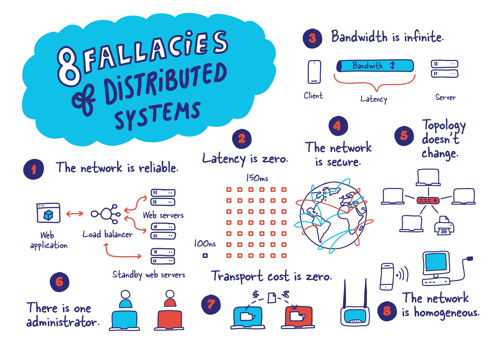
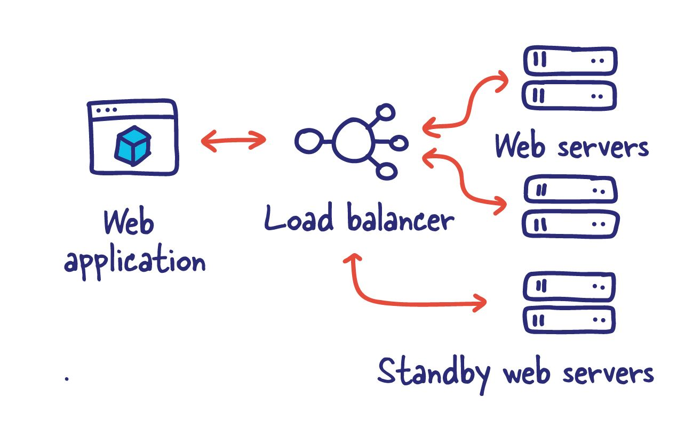
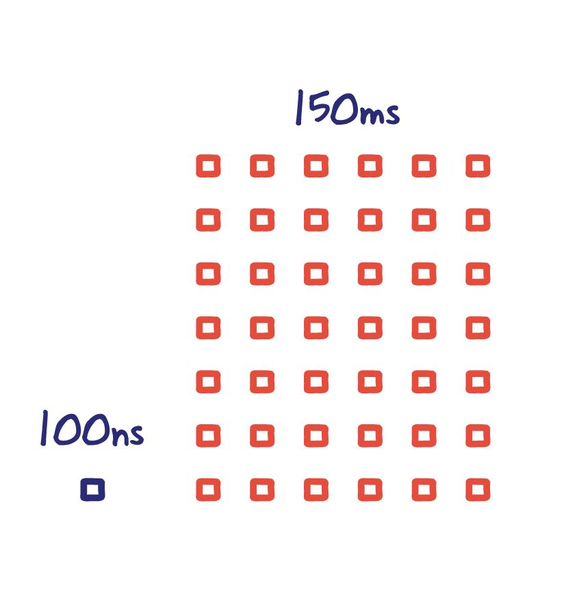
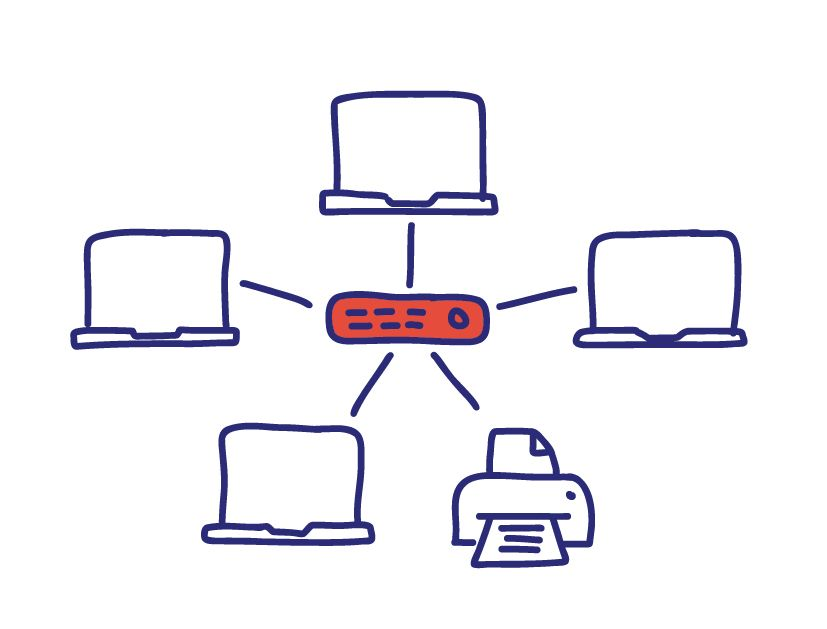

<!-- markdownlint-disable MD010 -->
# 分布式系统的谬误

> 原文链接：<https://architecturenotes.co/fallacies-of-distributed-systems/>
>
> 翻译：[Akagi201](https://github.com/Akagi201)

分布式系统的谬误是由 L Peter Deutsch 和 Sun Microsystems 公司的其他人提出的一套断言，描述了刚接触分布式应用的程序员无一例外地做出的错误假设。

微服务的大规模采用迫使更多的工程师了解这一决定在其系统中的影响。

在讨论系统设计时，我经常看到这 8 个谬误被普遍忽视或淡化。

我想介绍一下它们以及它们潜在的缓解措施可能会很有趣。

> ## 什么是微服务？
>
> 微服务--也被称为微服务架构--是一种架构风格，它将一个应用程序构建为服务的集合，这些服务具有以下特点
>
> * 高度可维护和可测试
> * 松散的耦合
> * 可独立部署
> * 围绕业务能力进行组织
> * 由一个小团队拥有
>
> 微服务架构能够快速、频繁、可靠地交付大型、复杂的应用程序。它也使一个组织能够发展其技术栈。

## 网络是可靠的

为了建立一个可靠的系统，你必须理解并接受这样一个事实：任何特定的通信都可能失败；因此，我们需要为系统提供一种方法来处理这种潜在的误传。因此，最终，这归结为重传，它可以有多种形式。

一个这样的模式是存储和转发模式。我们不是直接将数据发送到下游服务器，而是将其存储在本地或其他地方。这也允许在灾难性的情况下进行恢复，而简单的重试循环会缺乏这种保证。

有许多技术适合这种模式，如 RabbitMQ、ActiveMQ 和你喜欢的云计算供应商的各种专有解决方案。

## 没有延迟

> 左图是现代系统中访问内存的时间，右图是在世界范围内做一次往返旅行所需的时间。

我喜欢把延迟看作是完成任何请求的严格开销。信息可以很大，也可以很小，而延迟是不变的。与带宽不同，延迟通常与光速和通信距离（或路径）有关。所以两个系统之间的距离在这里起着重要作用。

延迟是无所不在的。它发生在所有的通信中。

理想情况下，这种开销应该尽可能的小。延迟非常类似于从汽车上卸下杂货。你从厨房到车上所花的时间就是延时。

你是想在一次旅行中抓取尽可能多的东西，还是想单独带着物品，花几百次往返来卸下汽车？

> ### 什么是 CDN?
>
> 内容分发网络（CDN）是指在地理上分布的一组服务器，它们一起工作以提供互联网内容的快速交付。
>
> CDN 允许快速传输加载互联网内容所需的资产，包括 HTML 页面、javascript 文件、样式表、图像和视频。CDN 服务的普及继续增长，今天大多数网络流量是通过 CDN 提供的，包括来自 Facebook、Netflix 和 Amazon 等主要网站的流量。

内容分发网络和边缘计算本质上是试图使冰箱和干线之间的距离尽可能地接近。通过将数据复制到离需要的地方更近的地方，我们大大减少了延迟。

## 带宽是无限的

假设你继续在一个信道上无限制地增加数据大小；可能是一个相当大的错误。这个问题只有在规模困难的情况下才会出现，而特定的通信信道也会达到其极限。

我第一次遇到这个问题是在我不小心将我的主页所需的有效载荷增加了 10 倍的情况下。这个特定的 API 在每次页面加载时都要进行 3MB 的无缓存调用。这包括整个有效载荷在数据库中的往返。

我们很快就遇到了我们系统中的几个带宽限制，这使网站很快就瘫痪了。

现在你可能在想，你只是告诉我在每次往返中尽可能多地采取一些措施来减少延迟的影响。这是真的，但它确实有其局限性。这在很大程度上取决于你的系统设计和各自的优先级，但意识到这种权衡是非常重要的。

## 网络是安全的

假设你可以信任你所在的网络或你为之建立系统的人，可能是一个至关重要的错误。

如今，随着众包漏洞赏金计划的出现和每天新闻中重大漏洞的出现，这一点变得更加明显。

在设计你的系统时采取安全第一的立场将在未来获得回报。即使花时间评估你当前系统的安全漏洞也是一个很好的开始，并将很快产生一个简短的改进清单。

## 网络拓扑不会改变

网络结构不会永远是一样的。例如，如果一个关键的基础设施发生故障，流量能否继续流向适当的目的地？我们有单点故障吗？

随着 Docker 和 Kubernetes 的出现，现在改变网络拓扑结构的便利性几乎使我们认为这是理所当然的，几乎是危险的。

像 Zookeeper 和 Consul 这样的工具确实有助于解决围绕服务发现的问题，并允许应用程序对我们系统的布局和构成的变化做出反应。

构建能够对这些拓扑结构的变化做出反应的系统可能很棘手，但最终会产生更具弹性的系统。

## 有一个管理员

这个问题让我花了一些时间来理解，基本上是说你不能控制一切。

随着你的系统的增长，它们将依赖于你控制之外的其他系统。因此，花点时间想想所有的依赖关系；你有一切，从你的代码到你运行它们的服务器。

有一个明确的方法来管理你的系统和它们各自的配置是非常重要的。随着具有不同配置的系统数量的增加，管理和跟踪变得很困难。基础设施即代码（IaC）可以帮助编纂你系统中的这些变化。

在问题出现时有一个很好的诊断方法，监控和可观察性将是关键的工具，可以节省你的时间。

适当的解耦也可以帮助确保整个系统的弹性和正常运行时间。

> ### 什么是基础设施即代码 (IaC)?
>
> 基础设施即代码（IaC）是通过代码而不是通过人工流程来管理和配置基础设施。
>
> 有了 IaC，就可以创建包含你的基础设施规格的配置文件，这使得编辑和分发配置更加容易。它还能确保你每次都能提供相同的环境。通过编纂和记录你的配置规格，IaC 有助于配置管理，并帮助你避免无记录的、临时性的配置变化。

## 传输层成本是 0

我们经常认为，我们用来在系统之间发送数据的资源是一种简单的商业成本。现在当事情很小的时候，这种开销和成本可以忽略不计。

尽管如此，随着系统的发展，这种成本可能是值得优化的，与 gRPC 或 MessagePack 等传输优化格式相比，JSON 等消息格式可能有点沉重（双关语）。

意识到这种成本是至关重要的；然而，它确实有其权衡。尽早这样做可能会在短期内造成更多的麻烦，而不是它的价值。

## 网络是同质的

在我的日子里，我写过不少的垫片；把一种格式的数据转换为另一种格式。

我们喜欢一切都干净整洁，但现实世界却远非如此。可互操作性是至关重要的。

这种灵活性确保我们的系统在 "新的热门框架" 出现时，或者当你需要在它并不打算使用的环境中运行你的新系统时，能够继续发挥作用。(显然，互操作性有其局限性)

知道所有的系统都不一样，不把你的解决方案耦合到一个方面，可以为你节省时间，并在以后的工作中避免头痛。
